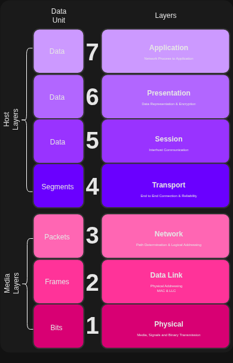

<div align="center">                                                                                                    
    <h1>Networking<br>Cheatsheet</h1>                                                                            
    <p>                                                                                                                 
        <em>Arrange and Manage Linux Communication Channels</em>
    </p>                                                                                                                
</div>                                                                                                                  

<br>                                                                                                                    
<br>

## Table of Contents

1. [What is the Internet](#what-is-the-internet)
2. [The IP Command](#the-ip-command)
3. [The tool Wireshark](#the-tool-wireshark)
4. [The Open Systems Interconnection (OSI) Model](#the-open-systems-interconnection--osi--model)

<br>
<br>

### What is the Internet

The _internet_ is a network of networks, an interconnected set of nodes which form a mesh and are able to communicate 
with each other. We can build a connection with pretty much any other computer on a network, without having a dedicated 
connection to the device. We do this through the use of packets which gets assigned an IP address.

<br>

### The IP Command
#### Inspecting Network Configurations

|Command|Description|Example|
|:---|:---|:---|
|`ip`|A powerful CLI tool for managing and diagnosing network configurations, also used to inspect and modify IP Address, routes and network interfaces. This is replaces the older `ifconfig`, `route` & `netstat` commands, as it can be used on more complex networks.|[View](#ip)|


#### ip
```sh
    ip addr show                                 # View our own network
     ↪ replaces ifconfig -a
```

<br>

### The tool Wireshark
#### Monitoring Network Traffic

Although Wireshark is a GUI application, we still use it as it displays a lot of useful information. Wireshark is a 
powerful network tool, which can intercept, monitor and analyze network traffic. Its important to not that this is 
illegal to or use on networks that do not belong to you.

Wireshark might capture sensitive information that is transmitted through the network. Deppending on where are based, 
the laws might be different. In some cases using Wireshark ethically is not a problem. These erhical use cases range 
from learning, teaching, ethical hacking, as long as you are not logging private information of others.

If you living alone, all your devices should be yours and should in this case be legal to use wireshark. Though if you 
living  with someone else, always ask for permission and or ask a network administrator for permission to use Wireshark.
Also consider checking the laws in your country before using Wireshark.

We can use Wireshark by installing it using `apt` and then running Wireshark with sudo privileges, as it needs elevated 
privileges in order to capture some information.

#### Steps for installing and use

1. `sudo apt install wireshark`
2. `sudo wireshark` 

<br>

### The Open Systems Interconnection (OSI) Model

As we already know the OSI model is a conceptual model, its used for understanding and designing computer networks. It
standardizes the functions and protocols across various different devices.

#### The OSI Model
 
<div align="center">
    <p>
        <strong>P</strong>lease <strong>D</strong>o <strong>N</strong>ot <strong>T</strong>hrow <strong>S</strong>ausage <strong>P</strong>izza <strong>A</strong>way
    </p>
</div>

|Layer Number|Layer                              |Short Description|
|:----------:|:----------------------------------|:----------------|
|7           |**Application Layer**<br>_Layer 7_ |Provides the interface for applications to communicate over the network.<br> ↪ **HTTP**, **FTP**, **SMTP**|
|6           |**Presentation Layer**<br>_Layer 6_|Translates, encrypts and compresses data for transmission between applications and networks.<br> ↪ **TLS/SSL**|
|5           |**Session Layer**<br>_Layer 5_     |Manages and controls the establishment, maintenance and termination of sessions between applications.|
|4           |**Transport Layer**<br>_Layer 4_   |Ensures reliable data between hosts<br> ↪ **TCP**, **UDP**|
|3           |**Network Layer**<br>_Layer 3_     |Manages data routing and forwarding between networks.<br> ↪ **IP Address**, **Routers**|
|2           |**Data Link Layer**<br>_Layer 2_   |Provies error-free data transfer between adjacent network nodes.<br> ↪ **Ethernet**, **MAC Address**|
|1           |**Physical Layer**<br>_Layer 1_    |Handles the transmission of raw data bits over a physical medium.<br> ↪ **Cables**, **Switches**, etc...|

<br>

<div align="center">
    
</div>

<br>

### Layer 1, The Physical Layer

The physical layer is what is referred to as the physical medium. This being copper cables, fibre optic cables and 
wireless among other things. It is responsible for converting digital data to signals, as well as converting signals 
back to digital data. Basically, layer 1 is a medium by which its able to send bits, or electrical signals.

#### How would we influence a layer 1 or physical layer?
We can do this by either switching off the hardware, or by unplugging the cable from the device physically, or through 
the use of software. To do this through the use of software, we first need to find the device name we want to influence.

We can find this out by using `ip addr show`, and this is an example of the output.

```sh
    1: lo: <LOOPBACK,UP,LOWER_UP> mtu 65536 qdisc noqueue state UNKNOWN group default qlen 1000
        link/loopback 00:00:00:00:00:00 brd 00:00:00:00:00:00
        inet 127.0.0.1/8 scope host lo
           valid_lft forever preferred_lft forever
        inet6 ::1/128 scope host 
           valid_lft forever preferred_lft forever
    2: eth0: <BROADCAST,MULTICAST,UP,LOWER_UP> mtu 1500 qdisc mq state UP group default qlen 1000
        link/ether 02:42:ac:11:00:02 brd ff:ff:ff:ff:ff:ff
        inet 192.168.1.10/24 brd 192.168.1.255 scope global dynamic eth0
            valid_lft 86399sec preferred_lft 86399sec
        inet6 fe80::42:acff:fe11:2/64 scope link 
            valid_lft forever preferred_lft forever
    3: wlan0: <BROADCAST,MULTICAST> mtu 1500 qdisc noop state DOWN group default qlen 1000
        link/ether 00:1a:2b:3c:4d:5e brd ff:ff:ff:ff:ff:ff
```

- `lo` &rarr; loopback interface.
- `eth0` &rarr; wired Ethernet interface with IPv4 and IPv6 addresses.
- `wlan0` &rarr; wireless interface (currently down).


```sh
    ip addr show
    ip link set dev [device] down                # Turn device off through software, placing it into sleep mode.
     ↪ ip link set dev [device] up               # Turn device on, taking it out of sleep mode.
```

<br>
