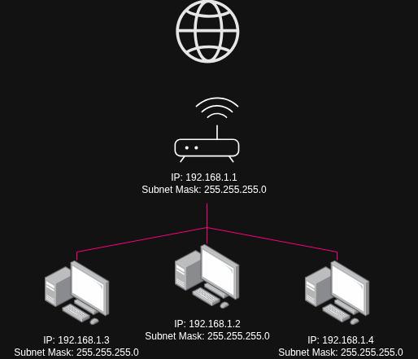
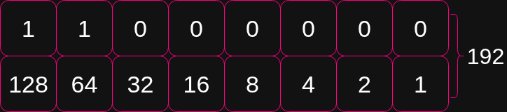

<div align="center">                                                                                                    
    <h1>Networking<br>Cheatsheet</h1>                                                                            
    <p>                                                                                                                 
        <em>Arrange and Manage Linux Communication Channels</em>
    </p>                                                                                                                
</div>                                                                                                                  

<br>                                                                                                                    
<br>

## Table of Contents

1. [What is the Internet](#what-is-the-internet)
2. [The IP Command](#the-ip-command)
3. [The tool Wireshark](#the-tool-wireshark)
4. [The Open Systems Interconnection (OSI) Model](#the-open-systems-interconnection--osi--model)
5. [Layer 1, The Physical Layer](#layer-1-the-physical-layer)
6. [Layer 2, The Data Link Layer](#layer-2-the-data-link-layer)
7. [Layer 3, The Network Layer](#layer-3-the-network-layer)
7. [Layer 4, The Transport Layer](#layer-4-the-transport-layer)
7. [Layer 5, The Session Layer](#layer-5-the-session-layer)
7. [Layer 6, The Presentation Layer](#layer-6-the-presentation-layer)
7. [Layer 7, The Application Layer](#layer-7-the-application-layer)

<br>
<br>

---

<br>

### What is the Internet

The _internet_ is a network of networks, an interconnected set of nodes which form a mesh and are able to communicate 
with each other. We can build a connection with pretty much any other computer on a network, without having a dedicated 
connection to the device. We do this through the use of packets which gets assigned an IP address.

<br>

---

<br>

### The IP Command
#### Inspecting Network Configurations

|Command|Description|Example|
|:---|:---|:---|
|`ip`|A powerful CLI tool for managing and diagnosing network configurations, also used to inspect and modify IP Address, routes and network interfaces. This is replaces the older `ifconfig`, `route` & `netstat` commands, as it can be used on more complex networks.|[View](#ip)|


#### ip
```sh
    ip addr show                                 # View our own network
     ↪ replaces ifconfig -a
```

<br>

---

<br>

### The tool Wireshark
#### Monitoring Network Traffic

Although Wireshark is a GUI application, we still use it as it displays a lot of useful information. Wireshark is a 
powerful network tool, which can intercept, monitor and analyze network traffic. Its important to not that this is 
illegal to or use on networks that do not belong to you.

Wireshark might capture sensitive information that is transmitted through the network. Deppending on where are based, 
the laws might be different. In some cases using Wireshark ethically is not a problem. These erhical use cases range 
from learning, teaching, ethical hacking, as long as you are not logging private information of others.

If you living alone, all your devices should be yours and should in this case be legal to use wireshark. Though if you 
living  with someone else, always ask for permission and or ask a network administrator for permission to use Wireshark.
Also consider checking the laws in your country before using Wireshark.

We can use Wireshark by installing it using `apt` and then running Wireshark with sudo privileges, as it needs elevated 
privileges in order to capture some information.

#### Steps for installing and use

1. `sudo apt install wireshark`
2. `sudo wireshark` 

<br>

---

<br>

### The Open Systems Interconnection (OSI) Model

As we already know the OSI model is a conceptual model, its used for understanding and designing computer networks. It
standardizes the functions and protocols across various different devices.

#### The OSI Model
> ❗**NOTE**: _Fun mnemonic to help remember the OSI Layers_ | **P**lease **D**o **N**ot **T**hrow **S**ausage **P**izza **A**way 

|Layer Number|Layer                              |Short Description|
|:----------:|:----------------------------------|:----------------|
|7           |**Application Layer**<br>_Layer 7_ |Provides the interface for applications to communicate over the network.<br> ↪ **HTTP**, **FTP**, **SMTP**|
|6           |**Presentation Layer**<br>_Layer 6_|Translates, encrypts and compresses data for transmission between applications and networks.<br> ↪ **TLS/SSL**|
|5           |**Session Layer**<br>_Layer 5_     |Manages and controls the establishment, maintenance and termination of sessions between applications.|
|4           |**Transport Layer**<br>_Layer 4_   |Ensures reliable data between hosts<br> ↪ **TCP**, **UDP**|
|3           |**Network Layer**<br>_Layer 3_     |Manages data routing and forwarding between networks.<br> ↪ **IP Address**, **Routers**|
|2           |**Data Link Layer**<br>_Layer 2_   |Provies error-free data transfer between adjacent network nodes.<br> ↪ **Ethernet**, **MAC Address**|
|1           |**Physical Layer**<br>_Layer 1_    |Handles the transmission of raw data bits over a physical medium.<br> ↪ **Cables**, **Switches**, etc...|

<br>

<div align="center">
    
</div>

<br>

---

<br>

### Layer 1, The Physical Layer

The physical layer is what is referred to as the physical medium. This being copper cables, fibre optic cables and 
wireless among other things. It is responsible for converting digital data to signals, as well as converting signals 
back to digital data. Basically, layer 1 is a medium by which its able to send bits, or electrical signals.

#### How would we influence a layer 1 or physical layer?
We can do this by either switching off the hardware, or by unplugging the cable from the device physically, or through 
the use of software. To do this through the use of software, we first need to find the device name we want to influence.

We can find this out by using `ip addr show`, and this is an example of the output.

```sh
    1: lo: <LOOPBACK,UP,LOWER_UP> mtu 65536 qdisc noqueue state UNKNOWN group default qlen 1000
        link/loopback 00:00:00:00:00:00 brd 00:00:00:00:00:00
        inet 127.0.0.1/8 scope host lo
           valid_lft forever preferred_lft forever
        inet6 ::1/128 scope host 
           valid_lft forever preferred_lft forever
    2: eth0: <BROADCAST,MULTICAST,UP,LOWER_UP> mtu 1500 qdisc mq state UP group default qlen 1000
        link/ether 02:42:ac:11:00:02 brd ff:ff:ff:ff:ff:ff
        inet 192.168.1.10/24 brd 192.168.1.255 scope global dynamic eth0
            valid_lft 86399sec preferred_lft 86399sec
        inet6 fe80::42:acff:fe11:2/64 scope link 
            valid_lft forever preferred_lft forever
    3: wlan0: <BROADCAST,MULTICAST> mtu 1500 qdisc noop state DOWN group default qlen 1000
        link/ether 00:1a:2b:3c:4d:5e brd ff:ff:ff:ff:ff:ff
```

- `lo` &rarr; loopback interface.
- `eth0` &rarr; wired Ethernet interface with IPv4 and IPv6 addresses.
- `wlan0` &rarr; wireless interface (currently down).


```sh
    ip addr show
    ip link set dev [device] down                # Turn device off through software, placing it into sleep mode.
     ↪ ip link set dev [device] up               # Turn device on, taking it out of sleep mode.
```

<br>

---

<br>

### Layer 2, The Data Link Layer

Once we have established a physical connection, we need a way to define who should receive the data. The data link 
layer is responsible for sending frames to specific devices, it does this through frame encapsulation, _its counter part
being decapsulation_. However, this is where **Logical Link Control** (_LLC_) and **Media Access Control** (_MAC_) comes
into play.

**LLC** is the interface between the Data Link Layer and the Network Layers. **MAC** gives us a way to identify the 
sender and receiver of a frame. **Frame Encapsulation** is the organizing of data into frames for transmission, as well
as adding the source and destination MAC address.

Some common protocols that run on the Data Link Layer, are **Ethernet**(_IEEE802.3_) & **WiFi**(_IEEE802.11_).

**Ethernet** or _IEEE802.3_ is a family of network technologies mostly used in LAN (Local Area Network). Ethernet splits 
the data into frames. A frame is usually maxed at 1.5kb in size. It contains the actual data that we want to transfer, 
as well as a checksum, so the destination can verify if it has received the data correctly.

It also contains addressing information, such as the MAC source and MAC destination.

**WiFi** or _IEEE802.11_ is a wireless networking protocol. The frames are identical to that of ethernet, but with WiFi
having extra data attach to identify the wireless connection. Still both **Ethernet** & **WiFi** are highly compatible 
with each other.

#### What exactl is a MAC Address?

The MAC address is a unique idenfier for network interfaces. Its a 48 bit (_6 byte_) split within 6 groups of 2 
hexadecimal digits, seperated by colons, e.g. `01:23:45:67:89:AB`. You can further break up the MAC Address between
**OUI** and **DSI**, Where the first 3 groups are the OUI and the last 3 groups DSI.

The MAC Address doesn't identify the computer itself, but the network interface card.

<br>

<div align="center">
    
</div>

<br>

#### Understanding Layer 2 Hardware, Bridges, Switches and Wireless Access Points.

Typical hardware for this layer are:

- Bridge
- Switchings (_Ethernet_)
    - ↪ _Some switches may also work on Layer 3_.
- Wireless Access Points
    - ↪ This is completely different from a wifi router, Where as a wireless access point only works on layer 2.

<div align="center">
    
</div>

<br>

---

<br>

### Layer 3, The Network Layer

With layer 2 or Data Link Layer, we could only send frames from one computer to another if the devices were connected 
directly to each other. If the computers were not directly connected, we would not have been able to send messages 
through layer 2, This is where the network layer comes into play.

Here we can send packets that can be routed to other networks, whereby **routing** refers to a packet being forwarded.
The idea is we no longer work with the MAC addresses but with IP addresses. Those packets can be forwarded to other 
networks.

#### What is a network?

A network is a group of interconnected devices that can communicate and share resources. Said devices can include 
computers, servers, printers, routers, switches and more. 

There are various types of networks:

- **PAN** _Personal Area Network_
- **LAN** _Local Area Network_
    - **WLAN** _Wireless Local Area Network_
- **CAN** _Campus Area Network_
- **MAN** _Metropolitan Area Network_
- **WAN** _Wide Area Network_
    - **WWAN** _Wireless Wide Area Network_
- **VPN** _Virtual Private Network_
- **GAN** _Global Area Network_

<br>

<div align="center">
    
</div>

<br>

#### How can we inspect this information

We can use `ip addr show` to view our IP address information, or `ip route show` to view the route it would take within
out network.

#### What is a subnet?

A subnet is a network within a network, allowing us to manage more computers at the same time, making large networks 
more efficient. At home out network is a subnet of the internet, while in a corporate setting we can split out  
corporate network into multiple subnets and increase the efficiency.

A **Subnet Mask** is what allows us to do this, its how we can differentiate if an IP is part of out network or another
network. A subnet mask is usually represented as `255.255.255.0` or in a short hand way, `192.168.1.2/24`.

For example is you had the following address:
- IP Address
    - 192.168.1.2
- Subnet Mask
    - 255.255.255.0

This would be represented in binary as:
- IP Address
    - 1100000.10101000.00000001.00000010
- Subnet Mask
    - 11111111.11111111.11111111.0000000

<br>

<div align="center">
    
</div>

<br>

> ❗ **NOTE**: _An IP of 192.168.1.0 is used for the gateway, while 192.168.1.255 is used for broadcasting on the network._

<br>

#### The Address Resolution Protocol & Dynamics of IP Packet Transmission

One of the questions that ARP helps us understand is, **How do we know where to send the frame to**?. We will be using 
the diagrams below to somewhat visualize how this works. 

<br>

<div align="center">
    
</div>

<br>

Looking at the diagram and focusing on encapsulation and not the ARP protocol, how does User A’s computer know 
where to send an IP packet? Before an IP packet can be sent, it must first be encapsulated inside an Ethernet frame,
which contains the MAC Address both of the source and destination.

If we’re sending this IP packet to another device within our own LAN, the Ethernet frame’s destination MAC address will 
be that of the target computer.Of course, the computer doesn’t magically know the destination MAC address, it uses the 
Address Resolution Protocol (ARP) to find it first. 
We’ll cover that part later, since for now we’re focusing on encapsulation itself.

If, however, the IP packet is destined for a device outside the local network, the source computer will not find a 
matching MAC address within the LAN. In that case, the Ethernet frame’s destination MAC address will be that of the 
default gateway (router), as shown in the top-right of the diagram.

#### ARP, the ARP Request & ARP Reply

<br>

<div align="center">
    
</div>

<br>

ARP exists to bridge the gap between Layer 3 (_IP Addresses_) and Layer 2 (_MAC Addresses_), If within the ARP Cache
there is no associated MAC Address for a said IP address, it will braodcast to the network, sending out an **ARP Request**.
The **ARP Request** asks all devices on the network "_who has this IP Address?_", and only the device that has said IP Address
will respond with an **ARP Reply**, all other devices will ignore this broadcast. The device would then update its ARP
cache.

##### Stages of the ARP Protocol
- ARP Request
- ARP Reply
- ARP Cache

#### Managing IP Addresses with the `ip` Command
##### Listing, Adding & Removing

If we want to add an IP address to an interface, we can use, 
- `ip addr add <ip_address>/<prefix_length> dev <interface>`<br>
 ↪ _To add an IP_
- `ip addr del <ip_address>/<prefix_length> dev <interface>`<br>
 ↪ _To remove an IP_

##### Example
```sh
    sudo ip addr add 192.168.1.10/24 dev enp0s5
    sudo ip addr del 192.168.1.10/24 dev enp0s5
```

> ❗ **NOTE**: _In most LAN Networks, the router is managing the IP Address, this process is known as DHCP, and it might be better to configure a MAC - IP Address in our routers backend_.
  
#### Navigating Network Routing
##### Inspecting Routing Tables & Adding Routes

We can inspect and modify our routes by using the `ip route show` command. We can also display specific details to see 
how or through which route a packet would be sent using, `ip route get <destination>`, example, `ip route get 8.8.8.8`.

We use:
- `ip route add <destination> via <gateway> dev <interface>`<br>
 ↪ _To add a route_
- `ip route del <destination> via <gateway> dev <interface>`<br>
 ↪ _To remove a route_

##### Example
```sh
    sudo ip route add 10.0.0.0/24 via 192.168.1.1 dev enp0s5
    sudo ip route del 10.0.0.0/24 via 192.168.1.1 dev enp0s5
```

#### Dynamic Host Configuration Protocol (DHCP)
##### Managing IP Addresses on Networks

As mentioned before, clients on a network are usually given a IP address automatically through a process which is 
handled by your router known as **DHCP**. The router usually has a **DHCP Server** which stores the IP address pool,
as well as manages IP address leases. 

Then we have a DHCP client which requests an IP address and configuration, this happens whenever a client joins a 
network.

#### The **DHCP** Process

- **DHCP Discover**
    - A DHCP client would braodcast a **Discover** message to a DHCP server, and only the DHCP relay or server will respond with an offer.
- **DHCP Offer**
    - The DHCP server/relay responds with a **DHCP Offer** message. The message contains IP address and lease information.
- **DHCP Request**
    - The DHCP Client sends a **DHCP Request** message, accepting the OP address and lease terms.
- **DHCP ACK**
    - The DHCP Server will respond with an **Acknowledge** message and confirms the IP assignment and lease duration.
 
#### Inspecting DHCP Logs with `systemd-networkd`
##### Troubleshooting IP Address Issues

We can inspect the DHCP Logs, using `journalctl -u systemd-networkd` to trouble shoot any issues that might arise.

#### The Program `ping`
##### Inspecting Network Connectivity by ICMP

Sometimes we want to inspect out connection to another computer using `ping`, example, `ping 8.8.8.8`. This uses a 
protocol known as **ICMP**, or  **Internet Control Message Protocol**. `ping`, will send a **Echo Request** and if the
destination supports it, will reply with a **echo reply**.

This allows us to measure the roundtrip time to a remote server.

<br>

---

<br>

### Layer 4, The Transport Layer

Until Layer 3, we still had various problems which needed solving, Although not demonstrated in the notes, packets 
being sent over a network is subjust to packet loss or being dropped. When a packet is dropped is dropped it is usually 
becuase the router is being overloaded with data and therefor the router will say, "_Hey, I cant handle this! So I'm just going to drop the packet/s_".

This is the problem we need to still solve and where there are two main protocols that come into play, which are 
**UDP** (_User Datagram Protocol_) & **TCP** (_Transmission Control Protocol_). 

In short, **UDP** says we want the **Application** Layer to handle out-of-order packets, or re-transmissions. This can 
be good for some application use such as Streaming or Video calling, where packet loss, out-of-order or re-transmissions 
is not a big issue. You can imagine how this would affect video calls, if it were to handle packet loss, the latency 
would be very high and the application would be unbareable to use.

On the flipside there is **TCP**, where it doesnt give over the packet loss, or out-of-order responsibility to the 
**Application** Layer, but rather deals with it on Layer 4 itself. This means that packets loss will be ordered by the 
receiver and re-transmitted, in order before transferring it back to the **Application** Layer.

Given the short summary of these protocols, we will now take a deep dive into **TCP** as this is the base for many 
protocols on the internet.

#### Diving Deeper into **TCP**

**TCP** is the base for many protocol on the internet today, **TCP** is a connection orientated protocol, whereby it
provides reliable, ordered and error checking data transmission. This is opperates on the **Transport** Layer of the 
OSI Model and allows us to write applications more easily.

This is because we can see the data stream, which contains the data in a correctly ordered way, without any parts 
missing. This costs us a bit of latency but ensures we receive or send data correctly. An example, some packets might 
be smaller or transmit daster than others, even though out-of-order, **TCP**, will wait for the slowst packet and
then start releasing the other packets again at the cost of a bit of latency.

It also ensures we utulize the bandwidth the receiver can handle or our connection can handle. These are known as 
**Flow Control** & **Congestion Control**

#### Ports in TCP & UDP

Ports are **16 bit** numbers assigned to specific process or services. Ports range from **0 - 65535** and  allow us to 
differentiate between multiple connections. There are different kinds of TCP ports:

- **Well Known Ports**
    - _These range between **0 - 1023**_
- **Reserved Ports**
    - _HTTP(80), HTTPS(443), FTP(20,21), SSH(22)..._ 
- **Registered Ports** _These are assigned to specific applications by IANA_
    - _MySQL(3306), PostgreSQL(5432), VNC(5900)_
- **Dynamic / Private Ports** _Not controlled by IANA, available for any application to use on as needed basis_
    - _These range between **49152 - 65535**_

#### TCP Port Communication

To help differentiate between ports, we have what is known **Source Ports** and **Destination Ports**. The Source port
is randomly assigned from the dynamic or private range and identifies the sending application of the client. While,
the Destination port identifies the receiving application on the server, this typically a well-known port or registered
port.

Then we have **Port Combination**, which is a unique combination of **Source IP**, **Source Port**, **Destination IP** 
& **Destination Port**. This helps us differentiate multiple connections between the same devices, allowing multiple 
connections to exist without conflicts.

#### Most Used Ports

|TCP Ports|Protocol|Port  |Name                                |
|:-------:|:-------|:-----|:-----------------------------------|
|         |HTTP    |80    |Web Server Communication            |
|         |HTTPS   |443   |Secure Web Server Communication     |
|         |FTP     |20, 21|File Transfer Protocol              |
|         |SSH     |22    |Secure Shell Remote Access          |
|         |Telnet  |23    |Remote Terminal Access (Unencrypted)|
|         |SMTP    |25    |Simple Mail Transfer Protocol       |
|         |IMAP    |143   |Internet Message Access Protocol    |
|         |POP3    |110   |Post Office Protocol _Version 3_    |

|UDP Ports|Protocol|Port      |Name                                                              |
|:-------:|:-------|:---------|:-----------------------------------------------------------------|
|         |DNS     |53        |Domain Name System                                                |
|         |DHCP    |67, 68    |Dynamic Host Configuration Protocol                               |
|         |SNMP    |161, 162  |Simple Network Manager Protocol                                   |
|         |TFTP    |69        |Trivial File Transfer Protocol                                    |
|         |NTP     |123       |Network Time Protocol                                             |
|         |RTP     |5004, 5005|Real-time Transfer Protocol<br> ↪ Used for Audio / Video Streaming|

#### The TCP Handshake Process, Establishing Reliable Connections

In order to find potential vulnerabilities in your network using port scanning, we need to understand the TCP Handshake
Process, or otherwise known as the **Three-way Handshake**.

The goal of a three-way handshake is that both computers need to know the the other side responds. Bother will later 
need to know how much data has already been received by ther other side using or exchanging sequence numbers, this is 
a randomly generated number which is usually incremented by the amount of bytes in the packet.

#### How does the Handshake work?

<div align='center'>
    

1. First, our computer will send a **SYN** packet to the remote computer.
2. The remote computer will send **SYN/ACK** packet back to us.
3. Then, we will respond with a **ACK** packet.

Thus a  connection would be established.

#### Port Scanning with Nmap

<br>

---

<br>

### Layer 5, The Session Layer

<br>

---

<br>

### Layer 6, The Presentation Layer

<br>

---

<br>

### Layer 7, The Application Layer

